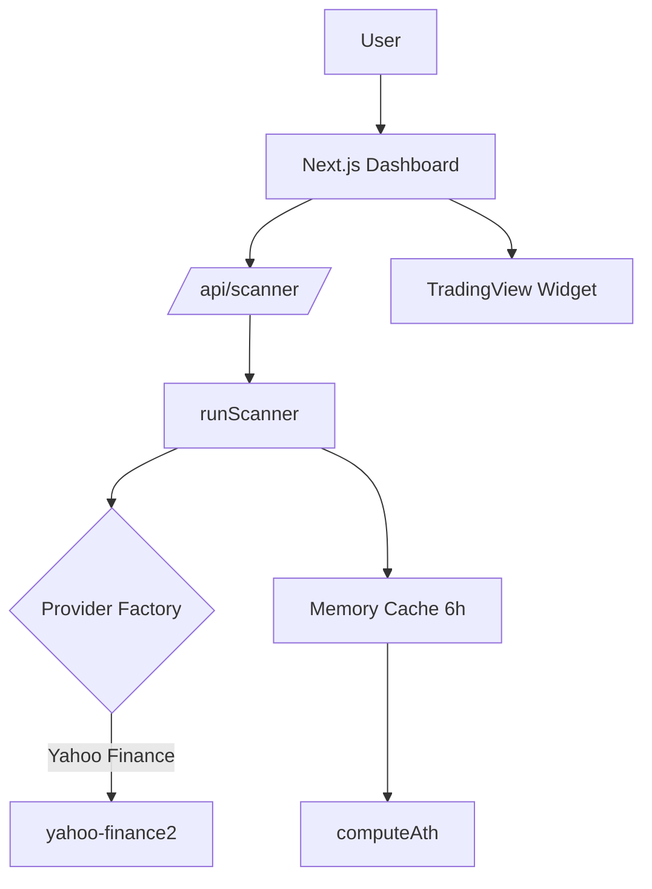

# 📈 Stock Scanner - IBEX35 ATH Detector

Aplicación Next.js para detectar acciones del IBEX35 en máximos históricos (ATH) o cerca de ellos, con soporte multiidioma y múltiples fuentes de datos.

## 🎯 Características

- ✅ **Scanner ATH**: Detecta acciones en máximos históricos o cerca (≤2%)
- 🌐 **i18n**: Soporte español e inglés (next-intl)
- 📊 **TradingView**: Gráficos interactivos en tiempo real
- 🔄 **Múltiples proveedores**: Yahoo Finance, Alpha Vantage, Stooq
- 💾 **Cache**: Almacenamiento en memoria (6h TTL)
- 🧪 **Tests**: Vitest con cobertura de lógica de dominio
- 🚀 **CI/CD**: GitHub Actions automático

## 🏗️ Arquitectura

Ver diagrama completo en [docs/diagrams/system.mmd](docs/diagrams/system.mmd)



## 🚀 Instalación

```bash
# Clonar repositorio
git clone https://github.com/AntonioMartinP/stock-scanner.git
cd stock-scanner

# Instalar dependencias
npm install

# Configurar variables de entorno
cp .env.example .env.local
# Editar .env.local con tu API key de Alpha Vantage

# Ejecutar en desarrollo
npm run dev
```

Abrir [http://localhost:3000](http://localhost:3000)

## ⚙️ Variables de Entorno

Crear archivo `.env.local`:

```env
ALPHA_VANTAGE_API_KEY=tu_api_key_aqui
```

> **Nota**: Yahoo Finance no requiere API key. Alpha Vantage tiene límite de 25 req/día (tier gratuito).

## 📡 API Endpoints

### GET `/api/scanner`

Escanea el mercado IBEX35 buscando acciones en ATH.

**Query Parameters:**
- `market` (required): `ibex35`
- `source` (optional): `yahoo` | `alphavantage` | `stooq` (default: `yahoo`)
- `mode` (optional): `ath_real` | `ath_52w` (default: `ath_52w`)

**Ejemplo:**
```bash
GET /api/scanner?market=ibex35&source=yahoo&mode=ath_52w
```

**Respuesta:**
```json
[
  {
    "ticker": "IBE",
    "name": "Iberdrola",
    "tradingViewSymbol": "BME:IBE",
    "ath": 13.45,
    "currentHigh": 13.62,
    "distancePct": 1.26,
    "isNewAth": true,
    "isNearAth": false
  }
]
```

## 🔍 Fuentes de Datos

### 1. Yahoo Finance (Principal)
- **Librería**: `yahoo-finance2` v3
- **Ventajas**: Sin API key, datos históricos completos
- **Formato**: JSON nativo
- **Estado**: ✅ Funcional

### 2. Alpha Vantage
- **API**: REST JSON
- **Limitaciones**: 25 req/día (free tier)
- **Estado**: ⚠️ Rate limited

### 3. Stooq
- **Formato**: CSV
- **Limitaciones**: No cubre acciones españolas
- **Estado**: 🔄 Mock fallback

## 🧮 Lógica de ATH

### ¿Por qué usar `high` en lugar de `close`?

El ATH se calcula usando el **precio más alto intradía** (`high`) porque:

1. **Refleja el máximo real**: El `high` captura el precio máximo alcanzado durante la sesión
2. **Relevancia técnica**: Los traders usan el `high` para niveles de resistencia
3. **Alerta temprana**: Detecta máximos aunque el cierre sea inferior

### Modos de cálculo

**`ath_real`**: ATH absoluto histórico (últimos 5 años)
```typescript
ath = max(candles.map(c => c.high))
```

**`ath_52w`**: Máximo de 52 semanas (~252 sesiones)
```typescript
ath = max(last252Candles.map(c => c.high))
```

### Umbral "Cerca de ATH"

Se considera que una acción está **cerca del ATH** si:
```typescript
distance = ((currentHigh - ath) / ath) * 100
isNearAth = distance >= -2 && distance < 0
```

## 🌍 Internacionalización

**Locales soportados**: `es` (español - default), `en` (inglés)

**Archivos de traducción**:
- `src/i18n/es.json`
- `src/i18n/en.json`

**Routing**:
- `/es/scanner` → Español
- `/en/scanner` → Inglés
- `/scanner` → Español (default)

**Middleware**: Detección automática de locale basada en headers

## 💾 Sistema de Cache

**Implementación**: In-memory cache (Map)
- **TTL**: 6 horas (21600 segundos)
- **Estrategia**: Cache-aside
- **Key format**: `history|provider|market|ticker|symbol`

**Ventajas**:
- Reduce llamadas a APIs externas
- Mejora tiempos de respuesta
- Respeta rate limits

## 📊 TradingView Widget

**Configuración**:
- Intervalo: Diario (1D)
- Timezone: Europe/Madrid
- Locale: Español
- Tema: Light

**Símbolos**: Formato `BME:TICKER` (Bolsa de Madrid)

## 🧪 Tests

```bash
# Ejecutar tests
npm test

# Watch mode
npm run test:watch
```

**Coverage**: Lógica de dominio (`computeAth.ts`)

## 🛠️ Stack Tecnológico

- **Framework**: Next.js 16.1.6 (App Router + Turbopack)
- **React**: 19.2.3
- **i18n**: next-intl 4.8.2
- **Estilos**: Tailwind CSS 4
- **Tests**: Vitest 4.0.18
- **Data**: yahoo-finance2 3.13.0
- **TypeScript**: 5 (strict mode)

## 📁 Estructura del Proyecto

```
src/
├── app/
│   ├── [locale]/           # i18n routing
│   │   ├── scanner/        # Scanner page
│   │   └── layout.tsx
│   └── api/
│       └── scanner/        # API endpoint
├── application/
│   └── usecases/           # Business logic orchestration
├── domain/
│   ├── entities/           # Stock, Market
│   └── services/           # computeAth
├── infrastructure/
│   ├── marketData/         # Data providers
│   └── cache/              # Caching layer
├── components/             # React components
├── config/                 # Market configurations
└── tests/                  # Unit tests
```

## 🚀 CI/CD

**GitHub Actions** (`.github/workflows/ci.yml`):
- ✅ Lint
- ✅ Tests
- ✅ Build

**Triggers**: Push a `main` y Pull Requests

## 📝 Decisiones Técnicas

### Provider Pattern
Abstracción para intercambiar fuentes de datos sin modificar lógica de negocio.

### Domain-Driven Design
Separación clara: dominio → aplicación → infraestructura → presentación.

### Error Tolerance
El scanner continúa aunque fallen acciones individuales (`Promise.all` con try-catch).

### Caching Strategy
Balance entre freshness y respeto a rate limits.

## 🤝 Contribuir

1. Fork del proyecto
2. Crear feature branch (`git checkout -b feature/AmazingFeature`)
3. Commit cambios (`git commit -m 'Add AmazingFeature'`)
4. Push a branch (`git push origin feature/AmazingFeature`)
5. Abrir Pull Request

## 📄 Licencia

MIT License - Ver archivo `LICENSE`

## 👤 Autor

Antonio Martín - [@AntonioMartinP](https://github.com/AntonioMartinP)

---

**Proyecto desarrollado como parte del TFM en Desarrollo con IA**
